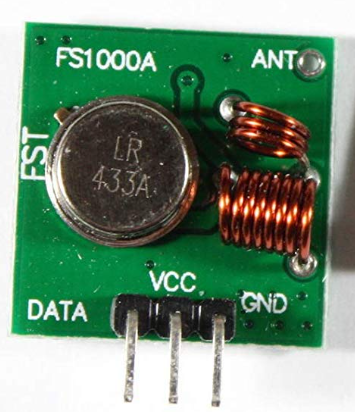
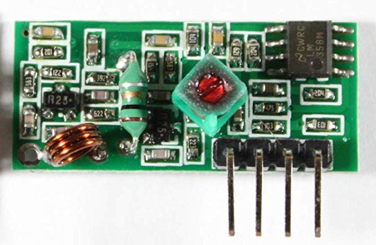

# raspberrypi-subghz-ASK
Experimentation with subghz modules, mainly on 433.92MHz. The project, like previous TV-B-Gone implementation, contains menu script, that you can use to choose between options, they are linked to python scripts with different purposes. And like the previous project, everything is public, you can do whatever you want, I don't really care. Maybe you could use this with more modules and even switch between frequencies, if you modify the script, but I only have this module and better solution would be just to buy CC1101 chip.
# Requirements
The script requires pigpio library to work, you can install it by running:
```
wget https://github.com/joan2937/pigpio/archive/master.zip
unzip master.zip
cd pigpio-master
make
sudo make install
```
# Usage
To use the script, make it executable with chmod and then simply run it with bash.
```
sudo chmod +x menu.sh
./menu.sh
```
It will enable pigpiod and throw you to menu, where you can choose some options, I only added signal replay option, more later...
# Transmitter
You can use simple ASK TX module, like fs1000a or something similar, I used some random ASK transmitter with two SMD RF transisotrs labeled "2D". I wanted the frequency to be very precise, so I used SAW resonator with label 433.92 meaning 433.92MHz and replaced the previous one. I connected this module data input to GPIO_13 and 5V supply.

'

Image of simple transmitter
# Receiver circuit
Like for transmitting, there are also cheap modules for reception of ASK modulation, like XY-MK-5V. I used different type with PT4317 superheterodyne receiver chip, that could theoretically work also on 315MHz, but I would need to replace SAW resonator. I connected this module data output to GPIO_25 and 3.3V supply.



Image of simple receiver
# Subghz file support
Because a lot of .sub files in subghz database contain RAW files, you can send them using external ASK module. This will probably work for bruteforcing and code search, but I haven't tested it yet, only with weather stations and that works well. I included some files from flipper database to test.
# External references
- https://github.com/Zero-Sploit/FlipperZero-Subghz-DB - Flipper zero subghz database
- https://github.com/merlinepedra25/flipperzero-bruteforce - Flipper zero bruteforce files
- https://github.com/SHUR1K-N/Flipper-Zero-Sub-GHz-Jamming-Files - Flipper zero jammer files
- https://github.com/Robbbbbbbbb/tesla-chargeport/tree/main/Flipper%20Zero - Tesla chargeport Flipper zero files
- https://abyz.me.uk/rpi/pigpio/index.html - pigpio library website
- https://github.com/breisa/433mhz - inspiration for signal cloning
# TO DO
- ASK protocol support like Princeton or Chamberlain
